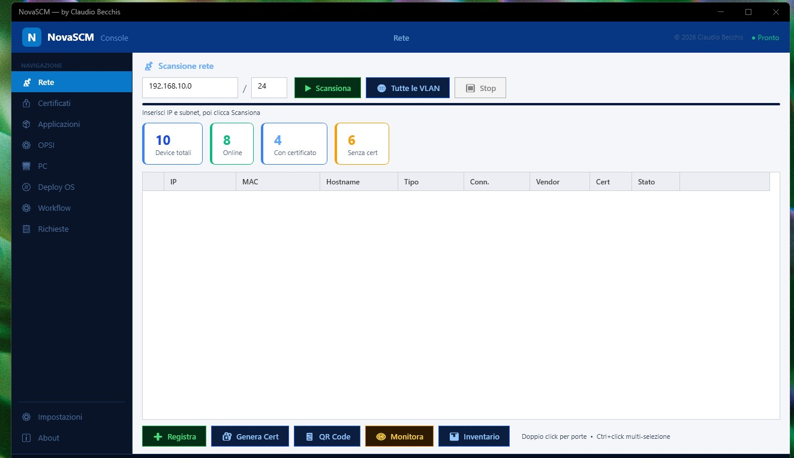
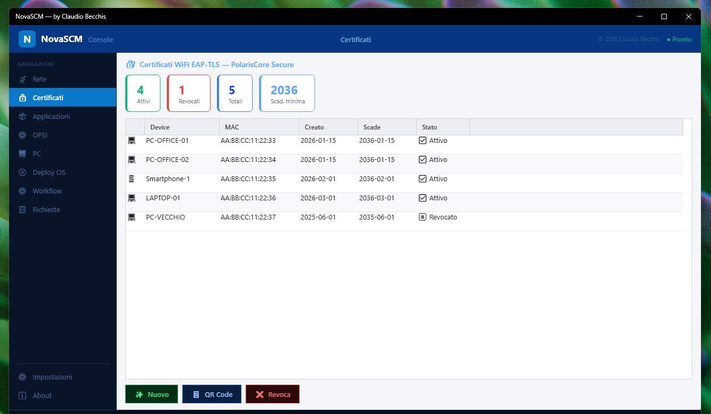
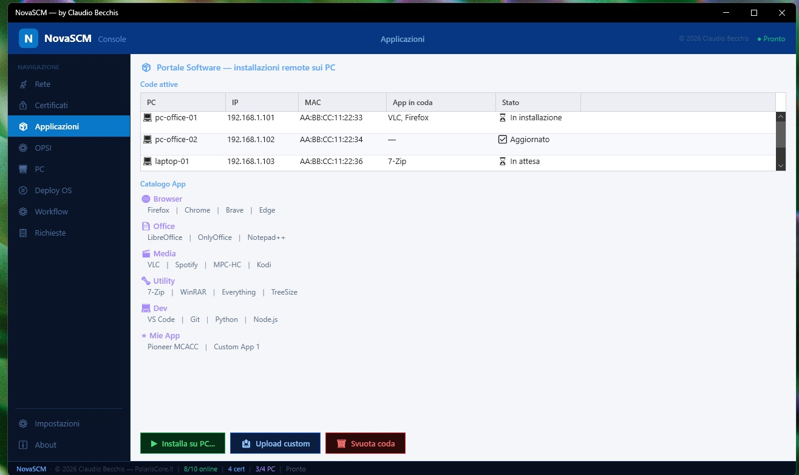
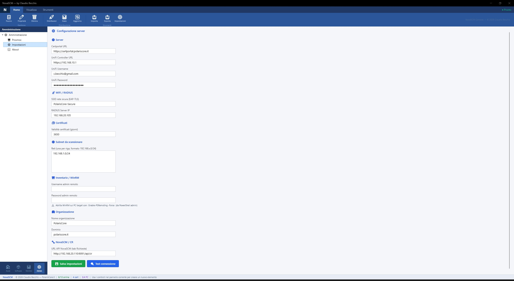

<p align="center">
  
</p>

<p align="center">
  <a href="LICENSE"></a>
  <a href="../../releases"></a>
  <a href="server/"></a>
  <a href="https://github.com/ClaudioBecchis/NovaSCM/releases/latest"></a>
</p>

# NovaSCM

> **Tired of paying for SCCM? There's a free alternative.**

NovaSCM is an open-source fleet & deployment manager for IT admins who want full control over their infrastructure — without the Microsoft price tag.

Deploy Windows in zero-touch, manage software, scan networks, issue WiFi certificates and track every machine from a single console.
**Built by an IT admin, for IT admins.**

NovaSCM combines a **WPF desktop console** (Windows), a **REST API server** (Python/Flask) and a **cross-platform agent** (Linux & Windows) — self-hosted, lightweight, no licensing fees.

📖 **Read the full article on dev.to:** [I built a free open-source alternative to Microsoft SCCM](https://dev.to/claudio_f5c23617499305b57/i-built-a-free-open-source-alternative-to-microsoft-sccm-3dkh)

---

## What it does

### Fleet Management
- **Network scanner** — discovers devices by IP/MAC, vendor detection, open port scan
- **Device inventory** — hostname, OS, hardware details, last seen
- **RDP & SSH one-click** — connect to any device directly from the console
- **Change Request system** — track deployment jobs per machine with status and notes

### Software Deployment (like SCCM Task Sequences)
- **Visual Workflow editor** — create multi-step deployment sequences (install, script, reboot, message...)
- **Step types**: `winget_install`, `apt_install`, `shell_script`, `windows_update`, `reboot`, `message`, `systemd_service`, `registry`, `file_copy`, `powershell`
- **Per-platform steps** — tag steps as `windows`, `linux` or `all`
- **Real-time progress** — live status per device, step-by-step log, progress bar
- **Auto-assign** — assign a default workflow; agent picks it up on next check-in

### OS Deployment (Zero-touch)
- **Generates `autounattend.xml`** — Windows 11 unattended install file, ready for USB or PXE
- **Generates `postinstall.ps1`** — runs on first boot: installs software via winget, enrolls the device
- **USB & PXE support** — copy files to a USB stick or push to a PXE server via SCP
- **PC naming template** — `PC-{MAC6}` renames the machine automatically from its MAC address

### WiFi 802.1X EAP-TLS
- **Certificate portal** — issues client certificates signed by an internal CA
- **Auto-enrollment agent** — installed on Windows, runs at startup, installs cert silently, adds WiFi profile
- **iOS mobileconfig** — one-tap install of CA + cert + WiFi profile from Safari
- **Android support** — QR code enrollment flow

### Network & Security
- **OPSI integration** — manage OPSI software packages and deployments
- **Port scanner** — per-device open port report
- **App catalog** — install/uninstall applications remotely

---

## Screenshots

<p align="center">
  
  
</p>
<p align="center">
  
  
</p>

---

## Architecture

```
┌──────────────────────┐      HTTP/REST      ┌──────────────────────────┐
│  NovaSCM Console     │ ◄─────────────────► │  NovaSCM Server          │
│  (WPF, Windows)      │                     │  (Flask + SQLite)        │
└──────────────────────┘                     │  port 9091               │
                                             └──────────┬───────────────┘
                                                        │ polling
                                             ┌──────────▼───────────────┐
                                             │  NovaSCM Agent           │
                                             │  (Python — Win & Linux)  │
                                             │  executes workflow steps  │
                                             └──────────────────────────┘
```

| Component | Technology | Platform |
|-----------|-----------|----------|
| Console (GUI) | C# / WPF / .NET 8 | Windows |
| Server (API) | Python 3 / Flask | Linux / Docker |
| Agent | Python 3 | Windows & Linux |
| Database | SQLite | — |
| Web UI | Alpine.js | Browser |

---

## Quick Start

### 1. Start the server

```bash
cd server
docker compose up -d
```

Server runs at `http://localhost:9091`.
Web UI available at `http://localhost:9091` (open in browser).

Or without Docker:
```bash
pip install flask gunicorn
python api.py
```

### 2. Seed demo data

```bash
python seed_demo.py --db /data/novascm.db
```

Creates 3 workflows, 6 demo machines and 4 assignments in different states (completed / running / pending).

### 3. Run the console

Download **`NovaSCM-Console.zip`** from [Releases](https://github.com/ClaudioBecchis/NovaSCM/releases/latest), extract and run `NovaSCM.exe` on your **Windows admin PC**.
Go to **Settings → NovaSCM API URL** and enter `http://<server-ip>:9091`.

> This is the management console — you run it once on your PC to control everything.

### 4. Deploy the agent on target machines

Download **`NovaSCMAgent-Win-x64.zip`** from [Releases](https://github.com/ClaudioBecchis/NovaSCM/releases/latest), extract and run `NovaSCMAgent.exe` on each **PC you want to manage**.

Or install it automatically via script:

On a Windows target machine (admin PowerShell):
```powershell
iwr http://<server-ip>:9091/api/download/agent-install.ps1 | iex
```

On Linux:
```bash
curl -fsSL http://<server-ip>:9091/api/download/agent-install.sh | bash
```

> The agent runs silently in the background, polls the server for tasks and executes workflows.

---

## Console Tabs

| Tab | Description |
|-----|-------------|
| **Network** | Scan subnets, view devices, RDP/SSH |
| **Certs** | Issue WiFi EAP-TLS certificates, manage CA |
| **Apps** | Application catalog, remote install |
| **PC** | Device list, Change Requests, enrollment |
| **OPSI** | OPSI package management |
| **Deploy** | Generate autounattend.xml + postinstall.ps1 for USB/PXE |
| **Workflow** | Create and manage deployment workflows, assign to PCs |
| **Requests** | Change Request tracker with status and log |
| **Settings** | API URL, subnets, credentials |

---

## Requirements

### Console (management GUI)
- Windows 10/11 x64
- .NET 8 Runtime — or use the **self-contained** `.exe` from Releases (no runtime needed)

### Server
The server runs on anything that supports Docker or Python.

**Option A — Docker (recommended, any OS)**

| Platform | Notes |
|----------|-------|
| Linux (Ubuntu, Debian, any distro) | Install [Docker Engine](https://docs.docker.com/engine/install/) + Compose plugin |
| Raspberry Pi (ARMv7/ARM64) | Use Docker Engine for ARM |
| macOS | Install [Docker Desktop](https://www.docker.com/products/docker-desktop/) |
| Windows 10/11 | Install [Docker Desktop](https://www.docker.com/products/docker-desktop/) with WSL2 backend |
| Windows Server 2019/2022 | Install Docker Desktop with WSL2 — requires WSL2 enabled (`wsl --install`) |
| Windows Server Core | ❌ WSL2 not supported — use Option B |
| VPS / cloud VM | Any provider (Hetzner, DigitalOcean, AWS, etc.) with Linux |

Minimum resources: **512 MB RAM**, **1 GB disk**

**Option B — Python directly (no Docker)**

- Python 3.10+
- Works on Linux and Windows (including Windows Server Core)

```bash
pip install flask gunicorn flask-limiter python-json-logger tftpy
python api.py
```

### Agent
- **Windows**: no dependencies — standalone `.exe` from Releases
- **Linux**: Python 3.8+ and `sudo` / root access

---

## Demo Styles

NovaSCM includes 3 GUI style demos (About tab → Demo Stili GUI) inspired by:
- **SCCM Console** — ribbon toolbar, tree navigation, results + details pane
- **Advanced Installer** — dark blue header, sidebar, stat cards
- **MSIX Packaging Tool** — step-by-step wizard layout

These are previews to choose the final UI design direction.

---

## Legal & Compliance

### License
NovaSCM is released under the **MIT License** — free to use, modify and distribute.
See [LICENSE](LICENSE) for the full text.
© 2026 Claudio Becchis — [PolarisCore.it](https://polariscore.it)

### Third-party software
NovaSCM is a **deployment tool** — it does not bundle, distribute or license any
third-party software. When you use NovaSCM to install applications (via winget,
apt or other package managers), those applications are downloaded directly from
their official sources and are subject to their own license agreements.

**You are solely responsible for:**
- Holding valid licenses for all software deployed through NovaSCM
  (including Windows OS, Microsoft 365, and any other commercial product)
- Complying with the End User License Agreements (EULAs) of all installed software
- Ensuring that Windows licenses cover each machine you deploy to

NovaSCM does not grant, transfer or sublicense any third-party software licenses.

### Network scanning & data collection
NovaSCM scans your local network to discover devices (IP addresses, MAC addresses,
hostnames, open ports). This data is stored locally in a SQLite database on your
own server — it is never transmitted to external servers.

**If you deploy NovaSCM in a business environment (EU):**
- Inform users/employees that network discovery is in use, as required by GDPR
- Ensure your organization's IT policy covers automated network inventory
- The API key protects access to collected data — keep it confidential

### Disclaimer
This software is provided **"as is"**, without warranty of any kind.
The author is not liable for any data loss, system damage, or compliance issues
arising from the use of NovaSCM. Always test in a non-production environment first.
